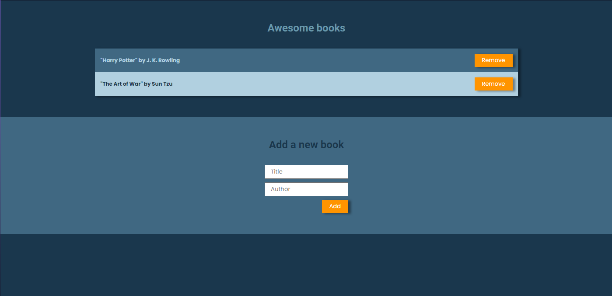

# Awesome books

> This is a javascript book list application



## Built With

- Javascript
- HTML
- SASS

## Live Demo

[Live Demo Link](https://leboroz.github.io/awesome-books/)

## Getting Started


To get a local copy up and running follow these simple example steps.

### Prerequisites
- git installed
### Setup
Open a terminal and run:
```
$ git clone https://github.com/Leboroz/awesome-books.git

$ cd awesome-books

$ open index.html
```
## Authors

👤 ** Leonardo Albornoz **

- GitHub: [@Leboroz](https://github.com/leboroz)
- Twitter: [@Leboroz](https://twitter.com/leboroz)
- LinkedIn: [LinkedIn](https://www.linkedin.com/in/leonardo-albornoz-216784198/)

👤 **Vincent Abuya Obunga**

- GitHub: [@vabuyia](https://github.com/vabuyia)
- Twitter: [@abuyiag](https://twitter.com/abuyiag)
- LinkedIn: [LinkedIn](https://linkedin.com/in/vincent-abuya-a1940555)

## 🤝 Contributing

Contributions, issues, and feature requests are welcome!

Feel free to check the [issues page](https://github.com/Leboroz/awesome-books/issues).

## Show your support

Give a ⭐️ if you like this project!

## 📝 License

This project is [MIT](./MIT.md) licensed.
